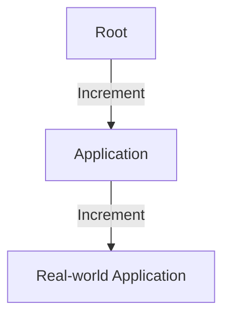
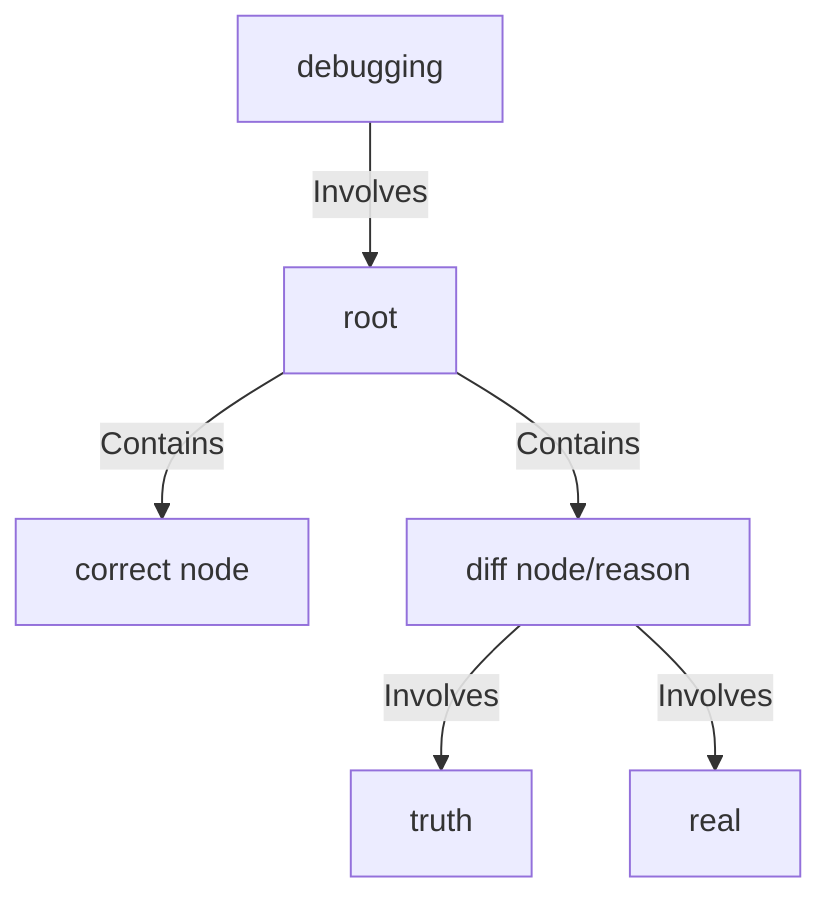

# Self-Learning: Navigating a Tree of Knowledge Structures

Knowledge serves productivity, with satisfaction and expertise as side effects. We categorize these effects as "application" and "theory," resembling real-world phenomena in natural and formal sciences.

## The Knowledge Tree

In computer science, application translates to real-world design, represented in code and documents. Theories generalize applications, forming a top-down order in a tree structure or a complex graph.

## Learning Efficiency

Constructing a knowledge tree involves a path from root to leaf, representing increments based on the parent node, culminating in a real-world application. This structure is more efficient for data storage than pure application memorization.

## Criteria for a Good Knowledge System

A good knowledge system is both succinct and reliable. Judging learning resources involves considering the size of the structure and the reliability of the source.

### Judging Learning Resources:

1. **Application (Ultimate):**
   - Source code or prototypes
     - Pros: Toward productivity.
     - Cons: Potential difficulty in understanding.

2. **Knowledge:**
   - Concepts
     - Pros: Used to understand documents.
     - Cons: May lack practical application.
   - Textbooks/Courses
     - Pros: Offers a tree structure.
     - Cons: May lack real-world application.

## Application of Knowledge

Storage involves direct or pointer methods, with consideration for the limited memory size. Utilization is through edges, defining how applications are generated from knowledge. Knowledge is crucial for debugging, emphasizing the need for a robust knowledge system.

## Conclusion

Balancing low-level speed and high-level understanding is key. A well-structured knowledge system enhances learning and application, contributing to efficient problem-solving and innovation. High-level reasoning may not always be slow; critical reasoning often resides at higher levels, demanding thorough consideration.
